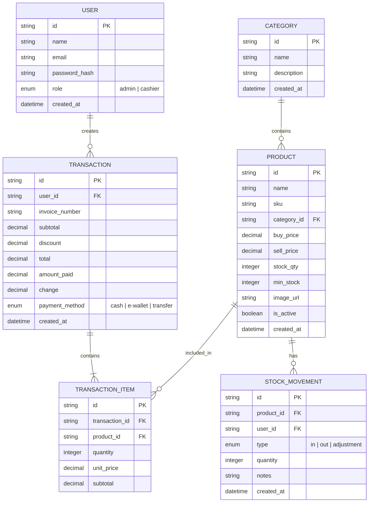
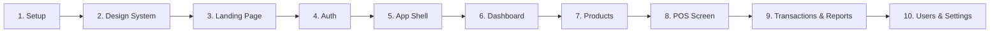

# KasirKu — Product Technical Document

> **Versi:** 1.0 (MVP)
> **Tanggal:** 17 September 2026
> **Author:** Gilang Anugrah

---

## 1. Ringkasan Produk

**KasirKu** adalah aplikasi kasir (Point of Sale) berbasis web untuk UMKM di Indonesia. Satu dashboard terpusat untuk mengelola transaksi penjualan, stok barang, dan laporan keuangan secara digital.

**Tujuan:** Menggantikan pencatatan manual (buku/spreadsheet) dengan sistem kasir digital yang mudah digunakan, cepat, dan bisa diakses dari mana saja.

---

## 2. Target Pengguna

| Persona | Deskripsi | Kebutuhan Utama |
|---|---|---|
| **Pemilik Usaha** | UMKM dengan 1–10 karyawan (warung, toko retail, kafe kecil) | Dashboard ringkasan, laporan keuangan, kontrol stok |
| **Kasir** | Karyawan yang melayani transaksi harian | Tampilan kasir yang cepat & simpel, hitung kembalian otomatis |

**Karakteristik user:** usia 20–50 tahun, familiar dengan smartphone tapi belum tentu paham software kompleks, koneksi internet bervariasi.

---

## 3. Tech Stack

| Layer | Teknologi | Alasan |
|---|---|---|
| **Frontend** | Next.js 15 (App Router) | SSR, routing, industri standard |
| **Language** | TypeScript | Type safety, portfolio value |
| **Styling** | Tailwind CSS | Rapid development, modern look |
| **State Management** | Zustand | Simpel, performant |
| **Charts** | Recharts | React-native charts, cocok untuk dashboard |
| **Backend/DB** | Supabase (PostgreSQL) | Auth, DB, storage — all-in-one BaaS |
| **Auth** | Supabase Auth | Built-in, mendukung RBAC |
| **PDF Export** | jsPDF / react-pdf | Generate struk & laporan |
| **Excel Export** | SheetJS (xlsx) | Export laporan ke Excel |
| **Deployment** | Vercel | Free tier, instant deploy |
| **Icons** | Lucide React | Konsisten, ringan |

**Pendekatan development:** UI-first with mock data. Semua halaman dibangun dengan data dummy dulu, baru integrasikan Supabase setelah UI selesai.

---

## 4. Arsitektur & Folder Structure

```
kasirku/
├── app/
│   ├── (auth)/
│   │   ├── login/page.tsx
│   │   └── register/page.tsx
│   ├── (dashboard)/
│   │   ├── layout.tsx                 ← Sidebar + Topbar shell
│   │   ├── dashboard/page.tsx
│   │   ├── pos/page.tsx
│   │   ├── products/
│   │   │   ├── page.tsx
│   │   │   └── new/page.tsx
│   │   ├── categories/page.tsx
│   │   ├── transactions/
│   │   │   ├── page.tsx
│   │   │   └── [id]/page.tsx
│   │   ├── reports/page.tsx
│   │   ├── users/page.tsx
│   │   └── settings/page.tsx
│   ├── layout.tsx                     ← Root layout (fonts, metadata)
│   ├── page.tsx                       ← Landing page
│   └── globals.css
├── components/
│   ├── ui/                            ← Reusable primitives (button, card, input, modal, table, badge, toast, select)
│   ├── landing/                       ← Landing page sections (hero, features, pricing, footer)
│   ├── dashboard/                     ← Dashboard widgets (stat-card, sales-chart, top-products, low-stock-alert)
│   ├── pos/                           ← POS components (product-grid, cart, payment-modal, receipt)
│   ├── layout/                        ← Layout components (sidebar, topbar, mobile-nav)
│   └── shared/                        ← Shared components (data-table, search-bar, pagination, empty-state)
├── lib/
│   ├── mock-data.ts                   ← Data dummy untuk development
│   ├── types.ts                       ← TypeScript interfaces
│   ├── utils.ts                       ← Helper functions (formatRupiah, generateInvoiceNumber, etc.)
│   ├── store.ts                       ← Zustand store (auth, cart, products)
│   └── constants.ts                   ← App constants
├── public/
│   └── images/
├── DESIGN.md                          ← Design direction (warna, font, tone)
├── ptd.md                             ← Dokumen ini
└── package.json
```

---

## 5. Sitemap & Routing

```
/                        → Landing page (public)
/login                   → Halaman login
/register                → Halaman register
/dashboard               → Dashboard utama (Admin)
/pos                     → POS / Kasir Screen (Admin & Kasir)
/products                → Daftar produk (Admin)
/products/new            → Tambah produk baru (Admin)
/products/:id/edit       → Edit produk (Admin)
/categories              → Manajemen kategori (Admin)
/stock                   → Manajemen stok (Admin)
/transactions            → Riwayat transaksi (Admin)
/transactions/:id        → Detail transaksi (Admin)
/reports                 → Laporan & analitik (Admin)
/users                   → Manajemen user (Admin)
/settings                → Pengaturan toko (Admin)
/profile                 → Profil user (semua role)
```

**Role-based access:**
- **Admin** → akses semua halaman
- **Kasir** → akses POS, profil, dan dashboard (read-only)

---

## 6. Data Model



### Key Relationships

| Relasi | Deskripsi |
|---|---|
| User → Transaction | 1 kasir bisa membuat banyak transaksi |
| Transaction → Transaction Items | 1 transaksi memiliki banyak item |
| Product → Category | 1 produk masuk ke 1 kategori |
| Product → Stock Movement | 1 produk memiliki riwayat perubahan stok |

---

## 7. Fitur MVP

### 7.1 Authentication & Authorization
- Login / Register dengan email & password
- Role-based access control (Admin & Kasir)
- Mock auth untuk development awal (data lokal + Zustand)
- Integrasi Supabase Auth setelah UI selesai

### 7.2 Dashboard
- 4 stat cards: Penjualan Hari Ini, Jumlah Transaksi, Rata-rata Transaksi, Revenue Bulan Ini
- Grafik penjualan 7 hari terakhir (Recharts — line/bar chart)
- Daftar 5 produk terlaris
- Alert produk dengan stok menipis

### 7.3 POS / Kasir Screen
Layout full-screen split view:

```
┌──────────────────────────────┬─────────────────────┐
│  Search + Kategori Filter    │  KERANJANG           │
│                              │                      │
│  ┌──────┐ ┌──────┐ ┌──────┐ │  Item A   x2   20k   │
│  │Prod A│ │Prod B│ │Prod C│ │  Item B   x1   15k   │
│  │ 10k  │ │ 15k  │ │ 15k  │ │                      │
│  └──────┘ └──────┘ └──────┘ │  ──────────────────── │
│  ┌──────┐ ┌──────┐ ┌──────┐ │  Subtotal:      80k  │
│  │Prod D│ │Prod E│ │Prod F│ │  TOTAL:         80k  │
│  │ 20k  │ │ 25k  │ │ 8k   │ │                      │
│  └──────┘ └──────┘ └──────┘ │  [ BAYAR ]           │
└──────────────────────────────┴─────────────────────┘
```

- Klik produk → masuk ke keranjang (dengan animasi)
- Quantity stepper (+/-)
- Payment modal: pilih metode (tunai/e-wallet/transfer), input nominal, hitung kembalian
- Quick amount buttons (Rp 50k, 100k, 200k, Uang Pas)
- Preview & cetak struk digital

### 7.4 Manajemen Produk
- Tabel produk dengan search, filter kategori, pagination
- CRUD: tambah, edit, hapus produk
- Fields: nama, SKU (auto-generate), kategori, harga beli, harga jual, stok, stok minimum, gambar, status aktif

### 7.5 Manajemen Kategori
- Tabel kategori
- Inline add/edit via modal
- Delete dengan konfirmasi

### 7.6 Riwayat Transaksi
- Tabel riwayat: No. Invoice, Tanggal, Kasir, Total, Metode Bayar
- Filter by tanggal, kasir
- Detail view per transaksi
- Cetak ulang struk

### 7.7 Laporan & Analitik
- Date range picker
- Tab: Penjualan | Produk | Profit
- Chart (Recharts) sesuai tab
- Summary cards di atas chart
- Tabel detail di bawah chart

### 7.8 User Management
- Tabel users
- Tambah user via modal
- Edit role (Admin / Kasir)
- Nonaktifkan user

### 7.9 Settings
- Info toko (nama, alamat, telepon, logo)
- Pengaturan struk (header/footer)
- Dark mode preference

---

## 8. Mock Data

Data dummy realistis untuk development tanpa backend:

- **20+ produk** — nama, harga, stok realistis dalam 4 kategori (Makanan, Minuman, Snack, Lainnya)
- **50+ transaksi** — tanggal bervariasi dalam 7 hari terakhir
- **2 user** — 1 Admin (admin@kasirku.com / admin123), 1 Kasir (kasir@kasirku.com / kasir123)
- **4 kategori** — Makanan, Minuman, Snack, Lainnya

---

## 9. Non-Functional Requirements

### Performance
| Target | Nilai |
|---|---|
| POS screen load time | < 1.5 detik |
| Dashboard load time | < 2 detik |
| Pencarian produk | < 300ms |
| Proses transaksi | < 500ms |
| Lighthouse score | > 85 |

### Security
- Password hashing (bcrypt via Supabase)
- JWT-based authentication
- Role-based access control (RBAC)
- Input validation & sanitization
- HTTPS only

### Usability
- Responsive: desktop, tablet, mobile
- Keyboard shortcuts di POS screen
- Dark mode
- Bahasa Indonesia sebagai default

### Accessibility
- Semantic HTML
- Contrast ratio minimum WCAG AA
- Keyboard navigable
- Aria labels pada elemen interaktif

---

## 10. Feature Priority (MoSCoW)

| Priority | Feature |
|---|---|
| **Must Have** | Auth + Role Management |
| **Must Have** | POS / Kasir Screen |
| **Must Have** | Manajemen Produk (CRUD) |
| **Must Have** | Dashboard ringkasan |
| **Must Have** | Laporan penjualan dasar |
| **Should Have** | Manajemen Stok |
| **Should Have** | Export PDF/Excel |
| **Should Have** | Grafik & chart analytics |
| **Could Have** | Bulk import CSV |
| **Could Have** | Barcode scanner |
| **Won't Have (v1)** | Multi-outlet/cabang |
| **Won't Have (v1)** | Integrasi payment gateway |
| **Won't Have (v1)** | Mobile app (native) |

---

## 11. Urutan Pengerjaan



---

## 12. Acceptance Criteria

MVP dianggap selesai jika:

- [ ] User bisa register dan login
- [ ] Admin bisa tambah, edit, hapus produk
- [ ] Kasir bisa melakukan transaksi via POS screen
- [ ] Struk bisa di-preview dan di-print
- [ ] Dashboard menampilkan ringkasan penjualan hari ini
- [ ] Laporan penjualan bisa dilihat berdasarkan tanggal
- [ ] Role admin & kasir memiliki akses berbeda
- [ ] Aplikasi responsive di desktop & tablet
- [ ] Deployed & accessible via URL publik

---

## 13. Roadmap

### Phase 1 — MVP (v1.0)
Landing page, auth, dashboard, POS screen, produk CRUD, laporan dasar, cetak struk.

### Phase 2 — Enhanced (v1.5)
Manajemen stok, export PDF/Excel, dark mode, keyboard shortcuts, bulk import CSV.

### Phase 3 — Advanced (v2.0)
Barcode scanner, multi-outlet, diskon & promo, customer database, integrasi QRIS (simulasi), notifikasi.
